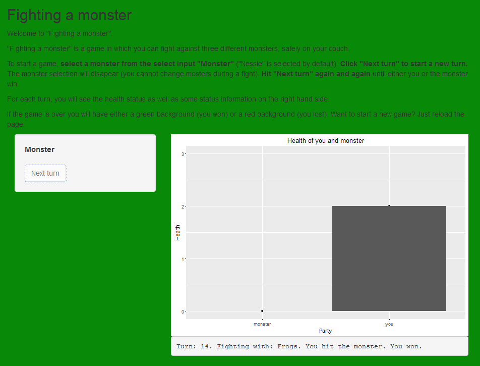

<!-- Taken from: http://stackoverflow.com/a/18640582 -->
<!-- Limit image width and height -->
<style type='text/css'>
img {
    max-height: 400px;
    max-width: 800px;
    margin: 20px;
}
</style>
<!-- Center image on slide -->
<script src="http://ajax.aspnetcdn.com/ajax/jQuery/jquery-1.7.min.js"></script>
<script type='text/javascript'>
$(function() {
    $("p:has(img)").addClass('centered');
});
</script>

## Fighting a monster: What

_Fighting a monster_ is a simple turn based game implemented in shiny. You select a monster and fight against it by clicking a button.

You see your health and the health of the monster each turn.

The graphs are updated each turn.



--- .class #id 
## Fighting a monster: Why

Fighting a monster is a simple use case for user interaction and dynamic graphs in shiny.

It uses the following features:

### javascript interaction

Disabling of buttons and select fields

### interactive graphs

Update of the health status each turn

### user interaction

User click on button triggers internal logic to update health status

---
## Fighting a monster: How

On button click, a function is called on the server calculating a random number between 1 and 6 (both inclusive) for the player and a random number between the monster strength and 6 (both inclusive) for the monster.


```r
monsters<-data.frame(Nessie=c(1), Alien=c(5), Frogs=c(3))
randomDiceResultPlayer<-sample(1:6, 1)
randomDiceResultMonster<-sample(c(monsters[1, "Alien"]:6), 1)
```

The party which has a result of 6 wins the turn. A possible turn would look like:


```r
playerHealth=3
monsterHealth=3
monsterHealth<-ifelse(randomDiceResultPlayer==6, monsterHealth-1, monsterHealth)
playerHealth<-ifelse(randomDiceResultMonster==6, playerHealth-1, playerHealth)
print(sprintf("New health player: %d, new health monster: %d", playerHealth, monsterHealth))
```

```
## [1] "New health player: 3, new health monster: 3"
```

---
## Fighting a monster: Where to go next

Currently: Super simple game design

To enhance game play:

- Animation of monsters/Images
- More influence for player decisions:
  - Trade health against strength
- More monsters
- Special abilities of monsters:
  - Different health
- Multiplayer?
